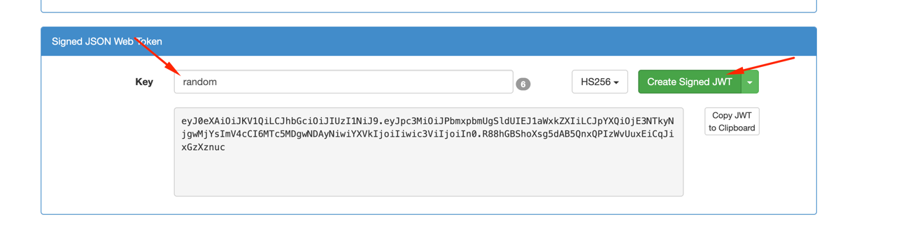

# Earthquake APP / Interview Exercise
This whole app was created under a interview exercise, done in ~17h (accumulative)

<!-- TOC -->
* [Earthquake APP](#earthquake-app)
  * [Stack decisions](#stack-decisions)
  * [How to Run locally with Docker](#how-to-run-locally-with-docker)
    * [Prerequisites](#prerequisites)
    * [Running with Docker Compose](#running-with-docker-compose)
    * [Default User Credentials](#default-user-credentials)
  * [Access](#access)
  * [Initial Data](#initial-data)
  * [Image processing](#image-processing)
    * [UI Image generation](#ui-image-generation)
  * [Authenticated API Calls](#authenticated-api-calls)
    * [1. Retrieve a List of Earthquakes (`GET /api/v1/earthquakes`)](#1-retrieve-a-list-of-earthquakes-get-apiv1earthquakes)
      * [**Example**:](#example)
    * [2. Retrieve a Specific Earthquake (`GET /api/v1/earthquakes/{id}`)](#2-retrieve-a-specific-earthquake-get-apiv1earthquakesid)
      * [**Example: Retrieve Record by ID**](#example-retrieve-record-by-id)
    * [CLI Script: `3d_image.rb`](#cli-script-3d_imagerb)
      * [Usage](#usage)
      * [Options](#options)
      * [Examples](#examples)
  * [Specs](#specs)
<!-- TOC -->


For this app I am using the stack:
- Framework: Ruby / Rails
- [Hotwire](https://hotwire.io/ecosystem)
- Bootstrap
- Postgres/Postgis

## Stack decisions
For this app, I decided to use this stack because:
- An MVC framework is enough for what is asked
- Rails provides a lot of boilerplate features that helps a lot the bootstrap of a project in such a short time
  - **Devise**: to manage authentication
  - **ActiveRecord**: to manage records from database
  - **Migrations**: to manage migrations
  - **Ransack**: for search
  - **Pagy**: for pagination
  - **Hotwire**: allows UI to be reactive through **turbo-frames** and **Stimulus** framework to any dynamic javascript
     - **OpenStreetMap** for map visualization
     - **ImageMagick** for image generation
     - **Threejs** for 3D visualization
  - **Sidekiq**: for jobs if needed (not in use for this app)
  - **Redis** Easy Integration: for cache if needed  (not in use  for this app)
- **Postgres**: a modern database with a lot of extensions to manipulate complex data structure such as jsonbs and geospatial data
  - with **postgis** adapter 
- Although Tailwind is on the rise, the old Twitter Bootstrap has a lot of utility classes and also allows easy customization
- Django would probably give the same benefits and maybe a bigger community of libs for image processing and data visualization, but by own convenience of knowledge and time, to leverage from my experience in my current job I decided on Rails (I got about this framework and its benefits).


## How to Run locally with Docker

### Prerequisites

* Docker installed on your system.

### Running it

1. **Build and Start Services**

    Run the following command in your project's root directory. This will build the application image, set up the PostgreSQL database, and start all services.

    ```bash
    docker-compose up --build
    ```

    The first run will be a bit slow as it installs all dependencies, but subsequent runs will be faster.


2. **Run Migrations and Seeds**

    Once the services are up and running, you need to set up the database. The `docker-entrypoint` script will automatically run migrations (`db:prepare`).  
    
    To populate the database with initial data, run the `db:seed` command in a separate terminal.

     ```bash
     docker-compose run --rm app bin/rails db:seed
     ```

    This command runs the `db/seeds.rb` file, which includes default user credentials.


### Default User Credentials

For easy testing, the seed file creates a default user with the following credentials:

* **Email:** `example@earthquake.ines.app.com`
* **Password:** `teste123`

You can change these values by setting the `USER_EMAIL` and `USER_PASSWORD` environment variables when running the `db:seed` command.

```bash
docker-compose run --rm \
  -e USER_EMAIL=your_email@example.com \
  -e USER_PASSWORD=your_password \
  app bin/rails db:seed
```

## Access

**Domains:**
- web app: http://lvh.me:3000/
- api: http://api.lvh.me:3000/

Pages are protected by normal user/password authentication


## Initial Data
The initial data is being stored once the server is booted, since there was no specific requirement about this (I am getting the data from USGS).
Eventually this could be a scheduled job running time to time, although I saw in USGS documentation they have specific API for real time data (I didn't explore too much this option, but could be an improvement depending on the use cases).

## Image processing

For image processing, I am using ImageMagick, chosen because it's recurrently used in Rails.

Initially I was generating an image from OpenStreetMap and use it to generate the 3d visualization, but I thought it wasn't that interesting.

So I decided to try and use earthquake's magnitude and depth in km to generate the baseline image of the earthquake and make in a 3d visualization.

I don't think this was well accomplished, the bigger the hole the bigger the magnitude and the depth of the 3d cone would be related with the depth of the earthquake.
But without a scale is not that useful and I think the depth is not changing that much...

I was thinking put this behind a FF, where you could turn on and off, since I don't feel confident about the feature itself.

For this effect, I have several services and one of them is being also used for the CLI.

### UI Image generation
These baseline images could be created on the moment of the fetching the data, but I don't think it's a good idea to generate images we don't know if they will be seen.
So I am generating them on demand and then store them to avoid unnecessary computation since the data doesn't change (assumption done here).

Also, once you enter the page it will be lazy loaded while the user moves within the page, a bit async, but not fully, you can't leave the page.
 
I am using **three.js** to visualize the 3D image

## Authenticated API Calls
Once the server is running, you can access the api docs through `/api-docs` path


You need to create JWT to use the API

> I didn't create any endpoint to generate the token, you can use this site http://jwtbuilder.jamiekurtz.com/
to generate one, without any extra fields and using the secret key.




Eventually we could use user email to generate it and check for access in token validation.

### 1. Retrieve a List of Earthquakes (`GET /api/v1/earthquakes`)

This endpoint supports filtering and pagination using the following query parameters:

**Pagination:**
-   page: The page number (e.g., `?page=2`).
-   limit: The number of items per page (e.g., `?limit=50`).

**Filtering (Ransack):**
-   magnitude_gteq: Magnitude greater than or equal to a value (e.g., `?magnitude_gteq=6.5`).
-   magnitude_lteq: Magnitude less than or equal to a value (e.g., `?magnitude_lteq=4.0`).
-   occurred_at_gteq: Events occurring after a specific date/time (e.g., `?occurred_at_gteq=2025-09-30T10:00:00Z`).
-   occurred_at_lteq: Events occurring before a specific date/time (e.g.,  `?occurred_at_lteq=2025-09-30T11:00:00Z`).
-   tsunami_eq: Filter by tsunami events (true or false).

#### **Example**:

This example gets the first page of 10 items, filtering for earthquakes with a magnitude greater than or equal to 5.0.

```bash
curl -X GET "http://api.lvh.me:3000/api/v1/earthquakes?magnitude_gteq=5&limit=10" \
      -H "Authorization: Bearer token"

```

### 2. Retrieve a Specific Earthquake (`GET /api/v1/earthquakes/{id}`)

This endpoint retrieves a single earthquake record by its ID.

#### **Example: Retrieve Record by ID**

```Bash

curl -X GET "http://api.lvh.me:3000/api/v1/earthquakes/123" \
      -H "Authorization: Bearer token"

```


### CLI Script: `3d_image.rb`

This script is a command-line utility for processing images using the `ImageTransformer` service. It can handle local file paths or remote URLs, apply a transformation, and save the result to a specified output file.

#### Usage

Run the script from your project's root directory using a `ruby` command.

```bash
ruby scripts/3d_image.rb [options]
````

#### Options

The following options are available to control the script's behavior:

* `-i`, `--input PATH_OR_URL`

    * **Required.** Specifies the path to a local image file or a URL to a remote image.
    * Example: `ruby scripts/3d_image.rb --input https://example.com/image.jpg`

* `-t`, `--transformation TRANS`

    * **Optional.** Specifies the image transformation to apply.
    * Available transformations:
        * `grayscale` (default)
        * `edges`
    * Example: `ruby scripts/3d_image.rb --input ./my_image.png --transformation edges`

#### Examples

1.  **Process a local image (default transformation):**

    ```bash
    ruby scripts/3d_image.rb --input ./path/to/my_image.png
    ```

2.  **Process a remote image with a specific transformation:**

    ```bash
    ruby scripts/3d_image.rb --input [https://www.example.com/image.jpg](https://www.example.com/image.jpg) --transformation edges
    ```

3.  **Process with Docker:**
    ```bash
    docker-compose run --rm app ruby scripts/3d_image.rb --input http://example.com/image.png
    ```

# Improvements

## Data fetching
To make this more async, a cronjob could be running each day to get the earthquakes from the past 24h. Depending on the use case, the Real Time api could be also considered

## Image generation
At the moment the temporary files are being stored locally, they should be deleted after being stored.
As for the stored images, they should eventually go to a file system service like S3 (in production mode).

## Audit
I didn't add any auditing since there's no exact action from the user besides login. 
In Rails, by adding Papertrail to the models, will magically create this by every commit in specific tables.

## Logging
Some logs are already added by Rails automatically, but it's not in a controlled way. At least for each service.call and endpoint exception it needs to be explicit.

Structure logging is always advisable.

## Specs are missing
Clearly the specs are missing. 
I tried to use rswag which allows to generate swagger files while also doing contract tests for the apis, but I wasn't successful for the time being.
Each service should also have a unit specs on its own and at least the details page should have a behavioral test because of the lazy loading.
